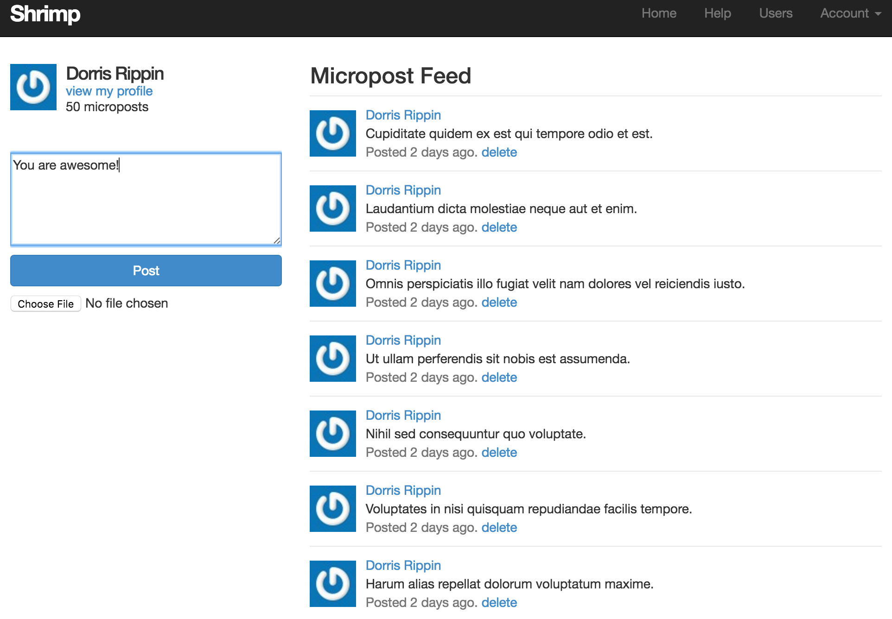

## Shrimp

Shrimp is a full-featured, micro-blogging platform which allows users to blog.
Main showcase: https://limitless-reaches-55599.herokuapp.com/

> Credentials:
> Email    - example-1@user.com
> Password - password

### Features:

 - Registration, authentication
 - Allows users to blog
 - Supports image uploading too. Resizing done in backend
 - Image uploads resricted to less than 5MB
 - Can browse profiles and microposts
 - Gravatar support included
 - Account-activation link sent to the registered email-id
 - 'Forgot password' feature included. Can reset password through a reset-link sent to the registered email-id
 - Pagination
 - 'Remember me' feature included
 - Uses Bcrypt hashing algorithm to store passwords 
 - Responsive UI. Uses Saas.
 - Extensive test coverage using minitest

 
